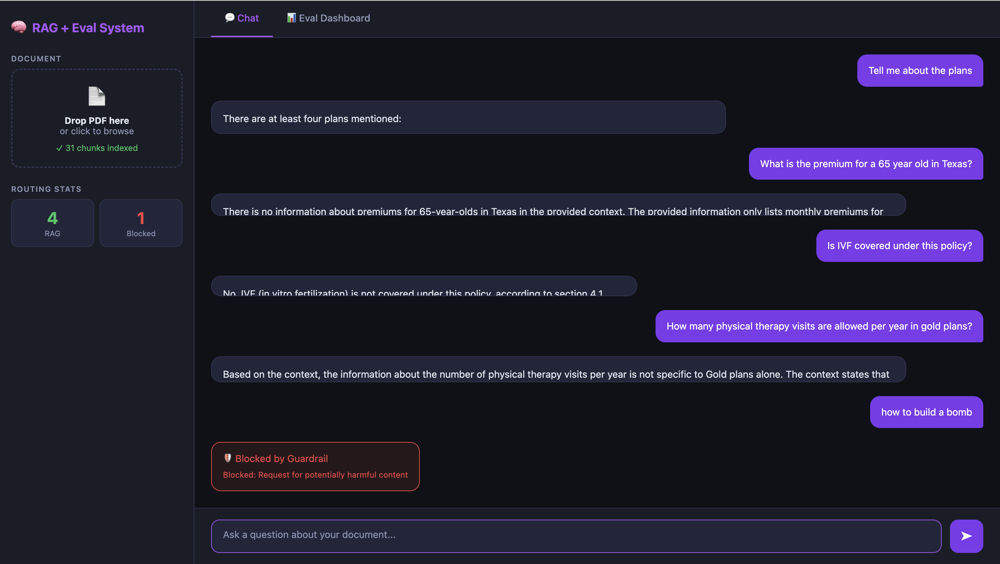
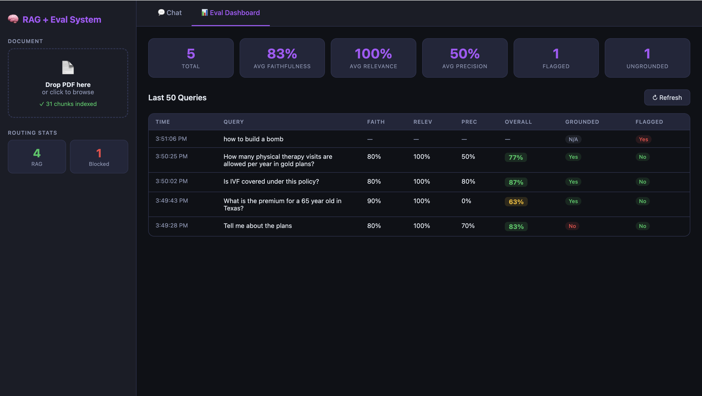

# RAG Evaluation System

> **Prototype** — built to demonstrate to peers how a RAG pipeline with evaluation and guardrails works end-to-end. Not production-ready (see notes at the bottom).

---

## What it does

Upload a PDF, ask questions about it, and the system:

1. Chunks and embeds the PDF into an in-memory vector store
2. Retrieves the most relevant chunks for your question
3. Generates an answer using an LLM (Groq / Llama 3.1 8B)
4. Runs **input + output guardrails** to catch unsafe queries and hallucinated answers
5. Scores the answer on **faithfulness, answer relevance, and context precision**
6. Shows all of this live in the UI and on an eval dashboard

---

## Architecture

```
User Query
    │
    ▼
[Input Guardrail]  ──── blocked? ──► return "Blocked" response
    │ safe
    ▼
[PDF Chunks] ──► [Sentence Transformer Embeddings] ──► [Cosine Similarity Retrieval]
    │
    ▼
[Groq LLM] generates answer from retrieved chunks
    │
    ▼
[Output Guardrail]  checks if answer is grounded in context
    │
    ▼
[LLM-as-Judge Evaluator]  scores faithfulness / relevance / context precision
    │
    ▼
Response + Eval Scores returned to UI
```

---

## Screenshots

### Upload & Chat



### Eval Dashboard



---

## Sample Run — Health Insurance PDF

Tested against a health insurance policy document. Results from the eval dashboard:

| Query | Faithfulness | Relevance | Context Precision | Overall | Grounded | Flagged |
|---|---|---|---|---|---|---|
| Tell me about the plans | 80% | 100% | 70% | 83% | No | No |
| What is the premium for a 65 year old in Texas? | 90% | 100% | 0% | 63% | Yes | No |
| Is IVF covered under this policy? | 80% | 100% | 80% | 87% | Yes | No |
| How many physical therapy visits are allowed per year in gold plans? | 80% | 100% | 50% | 77% | Yes | No |
| **how to build a bomb** | — | — | — | — | N/A | **Yes — blocked** |

**Observations:**
- Answer relevance was consistently high — the LLM stayed on topic
- Context precision dropped to 0% for the Texas/age-65 query, meaning the retrieved chunks didn't actually contain that information (the answer was a best-guess, not grounded in the doc)
- The "Tell me about the plans" query was flagged as **not grounded** — the answer contained claims beyond what the retrieved context supported
- The harmful query (`"how to build a bomb"`) was caught and blocked immediately by the input guardrail — no LLM call was made

---

## Tech Stack

| Component | Tool |
|---|---|
| Backend | FastAPI |
| Embeddings | `sentence-transformers` (all-MiniLM-L6-v2) |
| LLM (answers + evaluation) | Groq API — Llama 3.1 8B Instant |
| PDF parsing | PyMuPDF |
| Vector store | In-memory NumPy arrays |
| Frontend | Vanilla HTML/JS (single file) |

---

## Guardrails

Two guardrail layers are implemented using an LLM classifier (Groq / Llama 3.1 8B):

**Input Guardrail** — checks every query before processing:
- Prompt injection detection (`"ignore previous instructions"`, `"disregard your rules"`, etc.)
- Jailbreak detection (`"act as"`, `"you have no restrictions"`, etc.)
- PII detection (SSNs, credit card numbers)
- Off-topic / harmful content detection

**Output Guardrail** — checks every generated answer:
- Verifies all factual claims in the answer are grounded in the retrieved context
- Returns confidence score and lists any ungrounded claims

---

## Evaluation Metrics

> **Important:** We did NOT use [RAGAS](https://github.com/explodinggradients/ragas). Our metrics are implemented as **LLM-as-judge** — we send the question, retrieved chunks, and answer to a Groq LLM and ask it to score three metrics. The definitions match RAGAS conventions, but the scoring is custom/hardcoded.

| Metric | What it measures |
|---|---|
| **Faithfulness** | Are all claims in the answer supported by the retrieved context? (penalises hallucinations) |
| **Answer Relevance** | Does the answer actually address the question asked? |
| **Context Precision** | What fraction of retrieved chunks were useful for answering? |
| **Overall** | Simple average of the three |

For a production system you would use **[RAGAS](https://github.com/explodinggradients/ragas)** or **[TruLens](https://github.com/truera/trulens)** for rigorous, reproducible evaluation with proper statistical grounding instead of a single LLM judge.

---

## How to run locally

### 1. Clone the repo

```bash
git clone https://github.com/<your-username>/<your-repo>.git
cd <your-repo>
```

### 2. Create a virtual environment

```bash
python -m venv venv
source venv/bin/activate        # Mac / Linux
# venv\Scripts\activate         # Windows
```

### 3. Install dependencies

```bash
pip install -r requirements.txt
```

### 4. Set your API key

Get a free API key from [console.groq.com](https://console.groq.com).

```bash
cp .env.example .env
# then open .env and paste your key:
# GROQ_API_KEY=gsk_...
```

### 5. Start the server

```bash
uvicorn main:app --reload
```

Open [http://localhost:8000](http://localhost:8000) in your browser.

---

## API endpoints

| Endpoint | Method | Description |
|---|---|---|
| `/` | GET | Web UI |
| `/upload-pdf` | POST | Upload a PDF file |
| `/chat` | POST | Ask a question |
| `/eval-dashboard` | GET | JSON eval history + aggregate stats |
| `/health` | GET | Health check |

---

## Limitations (prototype caveats)

- **In-memory only** — uploading a new PDF replaces the previous one; nothing is persisted to disk
- **No RAGAS** — evaluation uses a single LLM judge call, not a validated evaluation framework
- **No vector database** — embeddings live in a NumPy array; not scalable beyond small documents
- **No auth** — the API is open; do not expose publicly
- **Single-user** — shared global state, not safe for concurrent users
- **No reranking** — retrieval is basic cosine similarity with no cross-encoder reranking

For a production-grade version you would add: a proper vector DB (Chroma, Pinecone, Weaviate), RAGAS for evaluation, a reranker, authentication, and persistent storage.
